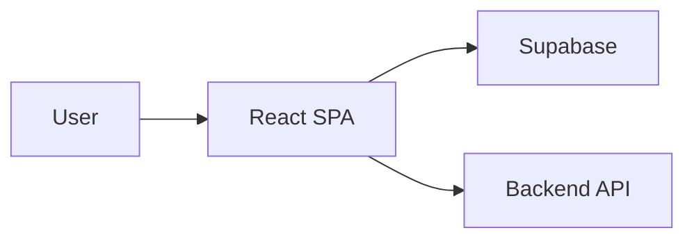

# Trademark Frontend

This repository is the **frontend** for the [Trademark Similarity Backend](https://github.com/jashlodhavia/trademark_backend) (AI-driven trademark infringement detection API: similarity check, logo indexing, email). Backend: [jashlodhavia/trademark_backend](https://github.com/jashlodhavia/trademark_backend).

A React SPA for trademark search, similarity checking, application tracking, and an agent dashboard (review, bulk upload). Built with Vite, Supabase for auth and data, and backend integration via Supabase Edge Functions.

## How it works with the backend

The backend exposes REST APIs (see [trademark_backend](https://github.com/jashlodhavia/trademark_backend)): **GET /** (health), **POST /similarity-check** (upload logo, get top-K similar trademarks with scores), **POST /submit-logo** (index a logo), **POST /send-email** (send HTML email; requires Resend API key on the backend).

This frontend does **not** call the backend directly from the browser. It uses **Supabase Edge Functions** that proxy to the backend:

- **Similarity (check + explore):** [src/lib/api.ts](src/lib/api.ts) calls `supabase.functions.invoke("similarity-proxy", { body: formData })`. That Edge Function forwards the logo to the backend's **POST /similarity-check** and returns results (e.g. `results`, `query_ocr`). Image URLs in the response are built from Supabase Storage (`trademark-images` bucket).
- **Email:** [src/lib/send-email.ts](src/lib/send-email.ts) calls `supabase.functions.invoke("send-export-email", { body: params })`. That Edge Function proxies to the backend's **POST /send-email** (e.g. for application confirmation and status-change emails).

**Data and auth:** Applications, users, and agent roles are stored in **Supabase** (Postgres + Auth). Logo uploads for applications go to Supabase Storage (`application-logos`). The backend is used only for similarity and email; the Edge Functions must be configured (in Supabase) to point at the backend URL.

The `VITE_API_BASE_URL` in [src/config/api.ts](src/config/api.ts) is available for any future direct API usage; currently the app relies on Edge Functions for backend calls.

## Features

- **Public:** Home, similarity check, explore similar marks, track application (by application number).
- **Agent (authenticated):** Login, dashboard, review application by ID, bulk upload; protected routes use Supabase auth and a `user_roles`-based agent check ([src/lib/auth.tsx](src/lib/auth.tsx)).

## Project structure

The app entry is `main.tsx` → `App.tsx`, which sets up React Router, Supabase auth, and TanStack Query. Routes and UI are organized under `src/`:

- **`src/pages`** — Route components: `Index`, `SimilarityCheck`, `ExploreSimilar`, `TrackApplication`; agent area: `Login`, `Dashboard`, `ReviewApplication`, `BulkUpload`
- **`src/components`** — Reusable UI (shadcn) and layout (`Layout`, `Header`, `Footer`, `GovBanner`, `ProtectedRoute`, `NavLink`)
- **`src/lib`** — Auth, API client, utils, mock data, email helpers
- **`src/integrations/supabase`** — Supabase client and generated types
- **`src/config`** — API base URL and env-based config
- **`src/hooks`** — Shared hooks (e.g. toast, mobile)

Key pieces: `lib/auth.tsx` provides `AuthProvider` and agent role; `lib/api.ts` and `config/api.ts` are used for backend integration; `integrations/supabase` holds the client and types.

### Routes

| Path | Page | Auth |
|------|------|------|
| `/` | Index | Public |
| `/check-similarity` | SimilarityCheck | Public |
| `/explore` | ExploreSimilar | Public |
| `/track` | TrackApplication | Public |
| `/agent/login` | Agent Login | Public |
| `/agent/dashboard` | Agent Dashboard | Protected |
| `/agent/review/:id` | Review Application | Protected |
| `/agent/bulk-upload` | Bulk Upload | Public |
| `*` | NotFound | Public |



## Prerequisites

- **Local:** Node.js 18+ and npm ([install with nvm](https://github.com/nvm-sh/nvm#installing-and-updating))
- **Docker:** Docker and Docker Compose

## Environment variables

| Variable | Required | Description |
|----------|----------|-------------|
| `VITE_SUPABASE_URL` | Yes | Supabase project URL |
| `VITE_SUPABASE_PUBLISHABLE_KEY` | Yes | Supabase anon/public key |
| `VITE_API_BASE_URL` | No | Backend API base; default in code if unset |

Get Supabase values from your project **Settings > API**. All `VITE_*` variables are baked in at build time (relevant for Docker).

## Run locally

1. Clone the repo and go to the project directory:
   ```sh
   git clone <YOUR_GIT_URL>
   cd trademark_frontent
   ```

2. Copy env example and set your Supabase credentials (and optional API URL):
   ```sh
   cp .env.example .env
   ```
   Edit `.env`: set `VITE_SUPABASE_URL` and `VITE_SUPABASE_PUBLISHABLE_KEY`. Optionally set `VITE_API_BASE_URL` (if unset, the app uses the default backend URL from `src/config/api.ts`).

3. Install dependencies and start the dev server:
   ```sh
   npm install
   npm run dev
   ```
   Open **http://localhost:8080**.

**What to expect:** Dev server runs at http://localhost:8080 with hot reload on save.

**Troubleshooting:** If port 8080 is in use, change it in [vite.config.ts](vite.config.ts) (`server.port`). If the app fails to load Supabase features, verify `.env` exists and both required vars are set.

## Run with Docker

`VITE_*` variables are embedded at **build** time. Ensure `.env` exists and is populated before `docker compose build`, since build args are taken from the environment (Compose loads `.env` from the project root for variable substitution).

```sh
cp .env.example .env
# Edit .env with your values, then:

docker compose build
docker compose up
```

App is served at **http://localhost:8080** (container listens on 80, mapped to 8080).

The image is built in two stages: the Node build stage runs `npm run build` with `VITE_*` build args; the nginx stage serves the built static files from `dist` on port 80 (see [Dockerfile](Dockerfile)). After code or env changes, run `docker compose up --build` or `docker compose build --no-cache` then `docker compose up`.

To build and run without compose:

```sh
docker build \
  --build-arg VITE_SUPABASE_URL=your_url \
  --build-arg VITE_SUPABASE_PUBLISHABLE_KEY=your_key \
  -t trademark-frontend .
docker run -p 8080:80 trademark-frontend
```

## Available scripts

| Command | Description |
|---------|-------------|
| `npm run dev` | Start Vite dev server (port 8080) |
| `npm run build` | Production build |
| `npm run build:dev` | Build in development mode |
| `npm run preview` | Preview production build locally |
| `npm run lint` | Run ESLint |
| `npm run test` | Run Vitest once |
| `npm run test:watch` | Run Vitest in watch mode |

Use `build` for production; `build:dev` for a development-mode build; `preview` serves the production build locally (e.g. to test before deploy).

## Tech stack

- **Vite** — Dev server and production build
- **TypeScript** — Typing
- **React 18** — UI
- **React Router** — Routing
- **Supabase** — Auth and data (Postgres, Storage, Edge Functions)
- **TanStack React Query** — Server state
- **shadcn-ui (Radix UI)** — Components
- **Tailwind CSS** — Styling
- **react-hook-form + zod** — Forms and validation; **recharts** — Charts where used

## Development

Run `npm run lint` and `npm run test` before pushing; tests use Vitest and Testing Library.

## Deploy and Lovable

You can edit this project in [Lovable](https://lovable.dev/projects/REPLACE_WITH_PROJECT_ID) and deploy via Share → Publish. To use a custom domain: Project > Settings > Domains → Connect Domain. See [Setting up a custom domain](https://docs.lovable.dev/features/custom-domain#custom-domain).
