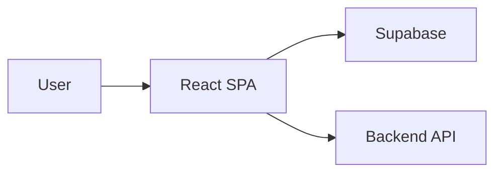

# Trademark Frontend

A React SPA for trademark search, similarity checking, application tracking, and an agent dashboard (review, bulk upload). Built with Vite, Supabase for auth and data, and an optional backend API.

## Project structure

The app entry is `main.tsx` → `App.tsx`, which sets up React Router, Supabase auth, and TanStack Query. Routes and UI are organized under `src/`:

- **`src/pages`** — Route components: `Index`, `SimilarityCheck`, `ExploreSimilar`, `TrackApplication`; agent area: `Login`, `Dashboard`, `ReviewApplication`, `BulkUpload`
- **`src/components`** — Reusable UI (shadcn) and layout (`Layout`, `Header`, `Footer`, `GovBanner`, `ProtectedRoute`, `NavLink`)
- **`src/lib`** — Auth, API client, utils, mock data, email helpers
- **`src/integrations/supabase`** — Supabase client and generated types
- **`src/config`** — API base URL and env-based config
- **`src/hooks`** — Shared hooks (e.g. toast, mobile)



## Prerequisites

- **Local:** Node.js 18+ and npm ([install with nvm](https://github.com/nvm-sh/nvm#installing-and-updating))
- **Docker:** Docker and Docker Compose

## Run locally

1. Clone the repo and go to the project directory:
   ```sh
   git clone <YOUR_GIT_URL>
   cd trademark_frontent
   ```

2. Copy env example and set your Supabase credentials (and optional API URL):
   ```sh
   cp .env.example .env
   ```
   Edit `.env`: set `VITE_SUPABASE_URL` and `VITE_SUPABASE_PUBLISHABLE_KEY`. Optionally set `VITE_API_BASE_URL` (if unset, the app uses the default backend URL from `src/config/api.ts`).

3. Install dependencies and start the dev server:
   ```sh
   npm install
   npm run dev
   ```
   Open **http://localhost:8080**.

## Run with Docker

`VITE_*` variables are embedded at **build** time. Have a `.env` in the project root (same as for local run) so Docker Compose can pass them as build args.

```sh
cp .env.example .env
# Edit .env with your values, then:

docker compose build
docker compose up
```

App is served at **http://localhost:8080** (container listens on 80, mapped to 8080).

To build and run without compose:

```sh
docker build \
  --build-arg VITE_SUPABASE_URL=your_url \
  --build-arg VITE_SUPABASE_PUBLISHABLE_KEY=your_key \
  -t trademark-frontend .
docker run -p 8080:80 trademark-frontend
```

## Available scripts

| Command | Description |
|---------|-------------|
| `npm run dev` | Start Vite dev server (port 8080) |
| `npm run build` | Production build |
| `npm run build:dev` | Build in development mode |
| `npm run preview` | Preview production build locally |
| `npm run lint` | Run ESLint |
| `npm run test` | Run Vitest once |
| `npm run test:watch` | Run Vitest in watch mode |

## Tech stack

- Vite, TypeScript, React, React Router
- Supabase (auth and data)
- TanStack React Query
- shadcn-ui (Radix UI), Tailwind CSS

## Deploy and Lovable

You can edit this project in [Lovable](https://lovable.dev/projects/REPLACE_WITH_PROJECT_ID) and deploy via Share → Publish. To use a custom domain: Project > Settings > Domains → Connect Domain. See [Setting up a custom domain](https://docs.lovable.dev/features/custom-domain#custom-domain).
